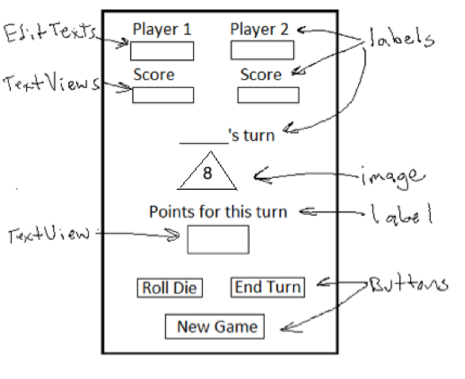

#Lab 2: Pig Game
CS235AM, Intermediate Mobile Application Development: Android
##Overview

In this lab, you will get practice working with:

- Debugging

- Constraint layouts

- Loading different layouts based on device orientation.  

##Part 1: Ch. 4 and 5 Exercises  

For each of the exercises shown below, do one of the following:

1. Follow all the steps shown in the book, build and ran the app. Experiement by changing some of the code to better understand how the app works.  

   OR

2. Download the completed solution, build and run it. Read through the steps in the book and inspect the relevant code. Experiement by changing some of the code to better understand how the app works.

**Do these exercises:**

- 4-1, Test and debug the Tip Calculator app
- 5-1, 

## Part 2: PIg Game  

###Using Different Layouts for Different Device Orientations   

**Group A: Big Pig – An 8-sided die, constraint layout for portrait, linear for landscape**

Create an app for playing a version of the dice game "Pig". 

The UI for your game should be similar to the one shown below:

The “Big Pig” version of the game is a dice game with 2 players and one die, but it is an 8-sided die. Each player rolls the die as many times as they wish or until they roll an 8. Their score for the turn is the sum of their rolls unless they get an 8, then it’s zero. When they roll an 8, the “Roll Die” button should be disabled, re-enable it when the next player starts their turn Players keep taking turns rolling until someone gets to 100. If the player who had the first roll reaches 100, the second player may still take their turn. The player with the highest score wins.

- Images will be provided for each side of the die.
- Provide different layouts for landscape and portrait orientation
  - Use constraint layout for the portrait layout
  - Use a table layout for landscape
- Use the names entered in the editable text views for Player 1 and Player 2 to display the name of the player whose turn it is.
- Disable the roll die button when an 8 is rolled
- Write a separate Pig class that will contain the logic for the game.
- Optional: Use a Frame Layout to hold a background image for the app (you can provide your own image).