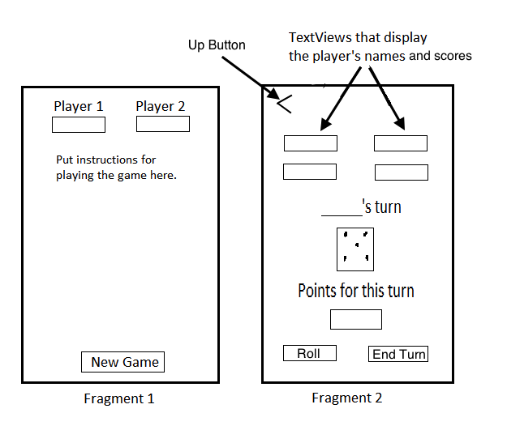
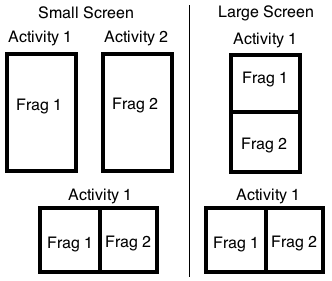

##Lab 5 – Pig Game with Fragments

**Purpose**
 This lab is designed to give you practice:

- Using multiple activities
- Using fragments to adapt your app to large and small screen sizes.
- Giving multiple fragments access to a single object (an instance of your game class).

**Part 1**

For each of the exercises shown below, do one of the following:

1. Follow all the steps shown in the book, build and ran the app. Experiement by changing some of the code to better understand how the app works.

   OR

2. Download the completed solution, build and run it. Read through the steps in the book and inspect the relevant code. Experiement by changing some of the code to better understand how the app works.

- 9-1, Test the Tip Calculator with fragments
- 9-2, Create a new fragment
- 9-3, Use the fragment manager

**Part 2: Pig Game, version 3**

In this lab you will modify your app to use fragments. You will have two fragments:

1. An opening screen that displays instructions and asks the players for their names. It will have a “New Game” button that launches fragment 2.

2. The UI for game-play (similar to the main activity in the previous lab). The up button on will take the user back to the opening screen.

- The up button will  only be needed when fragment 2 is displayed by itself in a separate activity.  
- In fragment 2, the player’s name for the current turn will need to be displayed.
- Fragment 2 will hold the game object. 

- On a small screen, in portrait orientation, only one of these two fragments will be displayed at a time, each in its own activity.
- On a large screen, in portrait orientation the fragments will be  displayed one above the other. 
- In landscape  orientation, the fragments will be displayed side-by-side. 

------

Written by Brian Bird, Lane Community College, Fall 2013. Revised Fall 2019

------

